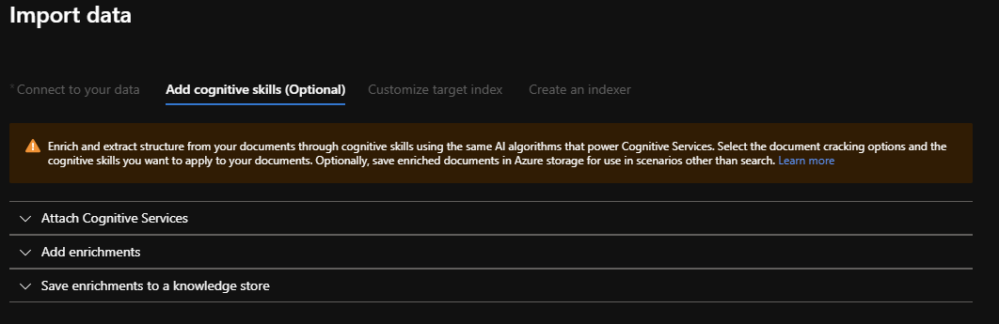
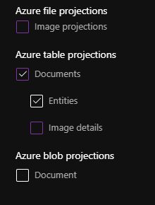
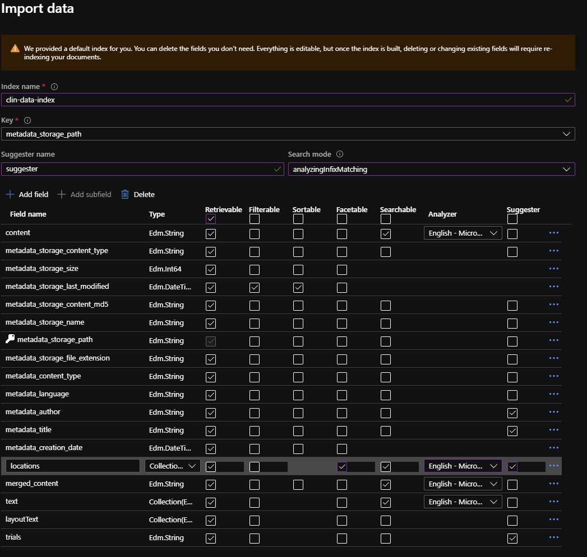

For now, we just want to do basic indexing of the PDFs.  

we will do this via the Portal (no-code)

* Navigate to your Search service
* `Import Data`
* Set `Data to Extract` to `Content and Metadata`

### Skillsets

`Cognitive Skills` are what we call "steps" that are needed to build a knowledge mining solution.  Think of these as micro-services where you string together small tasks to build pipelines.  We can do basic indexing using built-in skills.  Later we'll look at writing our own custom skills.  



Let's walk through this:

* For `Attach Cognitive Services` use the Cognitive service you already spun up.  
* `Add Enrichments`
  * click Enable OCR (since these are pdfs that we need to "crack")
  * for now, choose only `Extract location names`, we'll add more later
* `Save enrichments to a knowledge store`
  * Using the Knowledge Store enables you to use your data in scenarios that do not lend themselves naturally to search. Once your data has been loaded into the Knowledge Store, you can do things like kick off RPA, run analytics or visualize in tools like PowerBI.
  * Projections are your mechanism for structuring data in a knowledge store. For example, through projections, you can choose whether output is saved as a single blob or a collection of related tables. An easy way to view knowledge store contents is through the built-in Storage Explorer for Azure storage.

The knowledge store supports two types of projections:

Tables: For data that is best represented as rows and columns, table projections allow you to define a schematized shape or projection in Table storage.

Objects: When you need a JSON representation of your data and enrichments, object projections are saved as blobs.

For this case, we are going to use Azure table projections
* Set it up like this:


* and create the knowledge store in your existing storage account in a new container called `clin-data-knowledge-store`.  

### Next: Customize the target index.

This is an important and powerful part of the index build process as you select the types of Analyzer(s) you want to use and make determinations on features such as which fields and data will be retrievable, filterable, sortable, and searchable.

Set it up like this:



### Next: Create an Indexer

* name your indexer something memorable and meaningful (`clinical-data`)
* `Schedule: Once`

### Check the Indexer Status 

It will take a few minutes to create the indexer and do the indexing the first time.  You will see its status on the portal during this time.  

### Test the Indexer with the Portal

Now that the content has been indexed, we can use the portal to test some search queries. Open the Search explorer and enter a search query. Try these queries:

* `MPS`
* `MPS&highlight=content` : search for references to "MPS" and do hit highlighting of the content where there is a reference to it
* `gaucher&highlight=content` : note in the results that the analyzer was able to pick up variations of the phrase and highlights them using default tags.  
* `gaucher&highlight=content&$count=true`: what does this do?  

### Search with Postman

Most developers want to use external tools to start working against the service. Postman is popular for this. To set up the queries we will set the Headers as:

* `api-key: [Enter Admin API Key from Azure Search portal]`
* `Content-Type: application/json`

Retrieve the API key by pulling up your search service in the Azure Portal, selecting Keys, then copying one of the available admin keys.

When we configured the Indexing of the content, we asked for locations to be extracted from the content. Let's take a look at this by searching for morquio disease and limiting the results to only return the metadata_title, locations fields. Remember to update the params in the curly braces.  

`GET https://{name of your service}.search.windows.net/indexes/{ind name}/docs?api-version=2019-05-06&search=morquio&$select=metadata_title,locations`

Notice how the locations field is a Collection (or array of strings) that includes all the Location names extracted from the content.

Let's try to group all of the locations by using Faceting.

`...&search=morquio&$select=metadata_title,locations&facet=locations`

We can see how the search results has added a list of the top locations and how often they are found in documents that talk about Morquio.

Next, let's filter the results to documents that refer to Morquio and have a Location of "Emory University"

`&search=morquio&$select=metadata_title,locations&$filter=locations/any(location: location eq 'Emory University')`


the autocomplete capability can suggest terms that match what a user types. You have likely seen this in search boxes where users start typing and the system quickly suggests potential matches. Notice how this request is a POST as opposed to a GET.

`...docs/autocomplete?api-version=2019-05-06`

...and the body of the request should be "raw":

```JSON
{
   "fuzzy": true,
   "search": "hea", 
   "suggesterName": "{your suggester name in the Portal}", 
   "autocompleteMode": "twoTerms"
}

```
