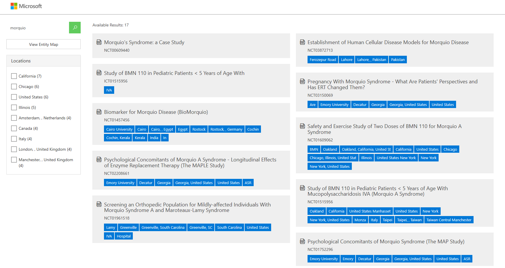

[Possible alternative lab for js](https://github.com/Azure-Samples/AzSearch.js)

A simple search page can help you visualize your search results.  We'll update this throughout the workshop as we add add'l features and capabilities.

We want our front-end to look something like this:  



We have a starter project that can help you with this:

`git clone https://github.com/Azure-Samples/azure-search-knowledge-mining.git`

There is a C# application that will help get you started.  Open `CognitiveSearch.UI.csproj (02-Web UI Template\CognitiveSearch.UI)` in Visual Studio.

You will need to update `appsettings.json`

```
  "SearchServiceName": "Your Search Service Name",
  "SearchApiKey": "Your Search Service key",
  "SearchIndexName": "Your index name",
  "InstrumentationKey": "",
  "StorageAccountName": "Your storage Account Name",
  "StorageAccountKey": "Your Storage Account Key",
  "StorageContainerAddress": "Your Storage Container Address",
  "KeyField": "metadata_storage_path",
  "IsPathBase64Encoded": true,
  "GraphFacet": "diseases"
```

Notes:

* `InstrumentationKey` is an optional field. The instrumentation key connects the web app to Application Insights in order to populate the Power BI reports
* The `GraphFacet` is used for generating the relationship graph, set it to the name of the facet that you would like to use (i.e. "diseases"). Or leave blank if you won't use the node graph.

Next:

* Set the Startup Project to `CognitiveSearch.UI`
* Run the Project
* Look at the code in more detail:
  * Much of the UI is rendered dynamically by javascript. Some important files to know when making changes to the UI are:

    * `wwroot/js/results.js` - contains the code used to render search results on the UI

    * `wwroot/js/details.js` - contains the code for rending the detail view once a result is selected