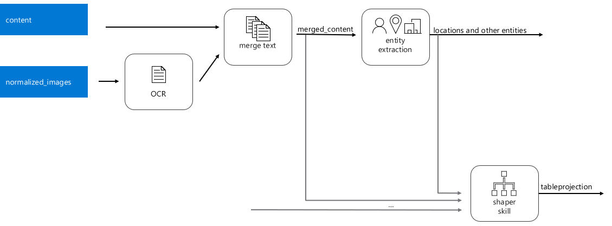
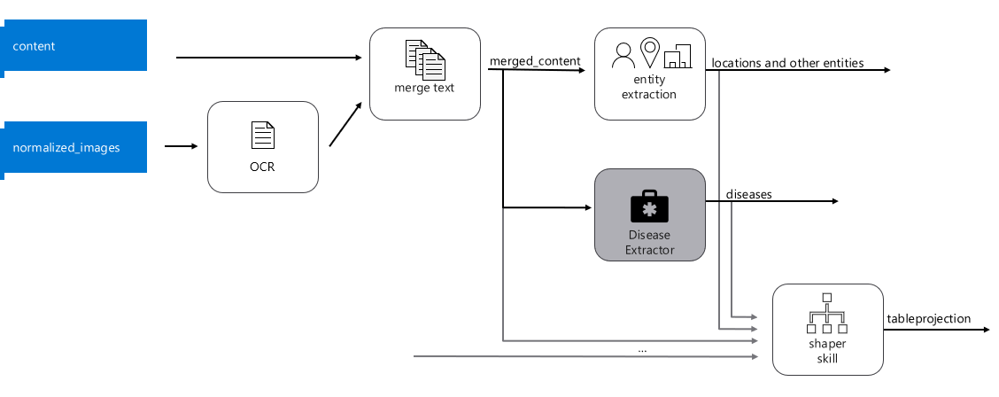

We want to programmatically manipulate our AzSearch objects.  This helps with automation, version control, and DevOps.

## Change the Index Definition

* You can only make additive changes to an index, otherwise you need to delete the index and start over.  
* Find the index definition in the Azure Portal.  This is in JSON format.  
* We are going to add 2 new fields based on our azfunc created in the previous lab
  * `diseases` :  holds a collection of diseases extracted from the text
  * `diseasesPhonetic`: holds the same data, but using a Phonetic analyzer, which is pre-built skill that allows you to search for words that sound phonetically similar.  We'll do this in the next lab.  

>> For all API calls you will need to set the following 2 header values in Postman:
>> * `api-key: [Enter Admin API Key from Azure Cognitive Search portal]`
>> * `Content-Type: application/json`

* First, get the index schema programmatically in Postman:
`GET https://{service}.search.windows.net/indexes/{index-name}?api-version=2019-05-06`
* copy the index schema.  Add a new fields element that looks like this:

```JSON
"fields": [
   ...,
   {
	"name": "diseases",
	"type": "Collection(Edm.String)",
	"searchable": true,
	"filterable": true,
	"retrievable": true,
	"sortable": false,
	"facetable": true,
	"key": false,
	"indexAnalyzer": null,
	"searchAnalyzer": null,
	"analyzer": "en.microsoft",
	"synonymMaps": []
   },
   ...
]
```

* In Postman change the GET to a PUT request with this new Body parameter.  
* You should see status 204 (update successful)
* Now we will modify the skillset to incorporate the extractor azfunc.  First, let's look at our skillset

`GET  https://{service}.search.windows.net/skillsets/{skillset-name?api-version=2019-05-06-Preview`

* Take a look at the JSON.  Semantically, it's doing something like this:



* We want to add our new skill to the pipeline.  Semantically, it should go here in the pipeline:



* We'll change the skillset by issuing a `PUT` to edit the skillset.  
* Copy/paste the JSON as returned above and add the following as an additional skill to the skillset:

```JSON
         {
            "@odata.type": "#Microsoft.Skills.Custom.WebApiSkill",
            "name": "diseases",
            "description": "Disease Extraction Skill",
            "context": "/document",
            "uri": "<az func URI>",
            "httpMethod": "POST",
            "timeout": "PT90S",
            "batchSize": 1,
            "inputs": [
                {
                    "name": "text",
                    "source": "/document/merged_content",
                    "inputs": []
                }
            ],
            "outputs": [
                {
                    "name": "entities",
                    "targetName": "diseases"
                }
            ]
        }
```
* Add a new record to the Shaper Skill, and add a new Table Projection
```JSON
       {
            "@odata.type": "#Microsoft.Skills.Util.ShaperSkill",
            "name": "#4",
            "description": null,
            "context": "/document",
            "inputs": [
            	{
                    "name": "diseases",
                    "sourceContext": "/document/diseases/*",
                    "inputs": [
                        {
                            "name": "disease",
                            "source": "/document/diseases/*/name"
                        }
                    ]
                },
                {
                    "name": "lastUpdatePosted",
                    "source": "/document/lastUpdatePosted",
                    "sourceContext": null,
                    "inputs": []
                },
```

Remember that document/diseases refers to an array of complex types, something like this:

```JSON
"document/diseases": 
[
    {
        "name": "heart failure",
        "matches": [
            {
                "text": "heart failure",
                "offset": 10,
                "length": 12,
                "matchDistance": 0.0
            }
        ]
    },
    {
        "name": "morquio",
        "matches": [
            {
                "text": "morquio",
                "offset": 25,
                "length": 7,
                "matchDistance": 0.0
            }
        ]
    },
    ...
]
```

and /document/diseases/* refers to the each of the members of that array -- each of those complex types.

This skill is shaping a new complex object called tableprojection that will have many members. You have just added a new member to it called diseases.

Since the "sourceContext" for this new member is "/document/diseases/*" , the new member itself will be an array of objects. Each of these objects will have a single member called disease with the name of each disease.

It's json representation would look something like this:

```JSON
"document/tableprojection" :
{
	"lastUpdatePosted": "August 10, 2017",
	"diseases" : [
	    {
	        "disease": "heart failure"
            },
	    {
	        "disease": "morquio"
            },
	    ...
	]
}
```

Modify the table projections to include this new field, as shown below:

Some tools like PowerBI know how to ingest tables and databases better than if we fed it a bunch of JSON objects. Now that we have an object with the shape that we want, we will project it into a set of tables that will be correlated.

Let's add one more table to the list for our new diseases member.  Change the values appropriately.  

```JSON
         "projections": [
            {
                "tables": [
                    {
                        "tableName": "clinicalTrialsSmallDocument",
                        "generatedKeyName": "Documentid",
                        "source": "/document/tableprojection",
                        "sourceContext": null,
                        "inputs": []
                    },
                    {
                        "tableName": "clinicalTrialsSmallEntities",
                        "generatedKeyName": "Entitiesid",
                        "source": "/document/tableprojection/Entities/*",
                        "sourceContext": null,
                        "inputs": []
                    },
		    {
			"tableName": "clinicalTrialsSmallDiseases",
                    	"generatedKeyName": "Diseaseid",
                    	"source": "/document/tableprojection/diseases/*",
                    	"sourceContext": null,
                        "inputs": []
                	}
                ],
                "objects": []
            }
```

When we do this, each disease extracted will be given a unique identifier (Diseaseid). Since "/document/tableprojection/diseases/*" is a child of "/document/tableprojection", the diseases table will automatically also get column called "Documentid".

After you have made these changes, complete the `PUT` request.

### Update the Output Field Mappings in the Indexer

Now we’ll follow a similar process to get and modify the Indexer. The Indexer is the element that glues everything together.

Add this `outputFieldMapping` to the indexer. This will specify where in the index we should store the diseases we just extracted. Make sure to do this in the `output field mappings` and not on the `field mappings`. Field mappings occur before enrichment, and output field mappings occurs post enrichment.

Do a GET and then a PUT with

`https://{service-name}.search.windows.net/indexers/{indexer-name}?api-version=2019-05-06`

```JSON
"outputFieldMappings": [
       ...,
       {
            "sourceFieldName": "/document/diseases/*/name",
            "targetFieldName": "diseases",
            "mappingFunction": null
        },
	...
```

This will map each of the names of the diseases complex types into a flat array (i.e. ["diabetes", "morquio", ...] )

Now, let’s reprocess documents. Go to the portal to `RESET` your Indexer and re `RUN` it.

### Test the New Data

* From Search Explorer and add the following string:

`search=*&facet=diseases`

This tells the search engine to search all documents (*) and group the results by diseases.

Let's also use this new field to allow us to do a strict filter to any documents that talk about the disease "morquio" search=*&$filter=diseases/any(disease: disease eq 'morquio')&$select=metadata_title,diseases

In the next lab we will look at the phonetic analyzer

## References

* https://github.com/Azure-Samples/azure-search-knowledge-mining/blob/master/workshops/Module%204.md