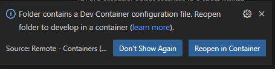

    
<h1 style="color:red;"><strong>Latent Data Analytics</strong></h1>

  
Dave Wentzel  

Philadelphia Microsoft Technology Center  

Contact Information:  [LinkedIn](https://linkedin.com/in/dwentzel)  
[Presentation](./LatentAnalytics.pdf)

# What is this?

It's likely that the most interesting data in your company is not being leveraged for analytics.  Unstructured data -- data that you might typically find in Word docs and PDFs -- could be the most valuable data that you own.  

The ability to _crack_ unstructured data could allow you to gain new insights.  But _latent data analytics_ is far more than just pdfs and docx's.  

>This session is meant to show you the Art of the Possible using non-traditional data.  Hopefully this sparks some ideas that you can use at your company.  

# Today's Use Cases

Here's what we'll look at today:

* What are [Cognitive Services](https://azure.microsoft.com/en-us/services/cognitive-services/#overview)?

* Azure Search is what most people think of when they think of _Latent Data Analytics_.  
  * [JFK Files](https://jfk-demo.azurewebsites.net/#/):  there's no better way to see the Art of the Possible than with a fascinating use case.  
    * You can build this yourself **using _your_ latent data** by following this gh repo:  https://github.com/Microsoft/AzureSearch_JFK_Files
* Interested in learning `Cognitive Search` using your datasets?  The rest of this repo is a Knowledge Mining Workshop we do.  See [README-labs.md](./README-labs.md) to get started. 
* Let's look at some [Cognitive Services using examples]()
  * These should work using `vscode devcontainers` but you can follow along in github too.  

_if you want to try the devcontainer_:

1. Open a new instance of vscode to the folder:  `./Lab500`
1. vscode will prompt you to open the folder in the container.  Do that.  

Now open each ipynb file within the container.  

>> We do this because the docker container already has all of the Azure and AMLS dependencies baked in, saving us a lot of time and workstation configuration misery.  

|Lab|Description|
|----|------|
|[Computer Vision](./Lab500/CompViz.ipynb)|Using CompViz with the SDK from Python|
|[Face API](./Lab500/face.ipynb)|Using the Face API|
|[OCR capabilities](./Lab500/OCR.ipynb)|optical character recognition|
|[text analytics](./Lab500/text.ipynb)|text analytics|
|[Sentiment analysis on Yelp! data](./Lab500/yelp.ipynb)|text analytics|
|[Form Recognizer](./Lab500/FormRec.ipynb)|Form Recognizer|

* Demo: Infuse non-traditional data into your applications
  * this uses a bunch of technologies we will look at today.  

